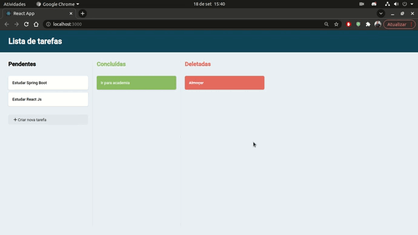
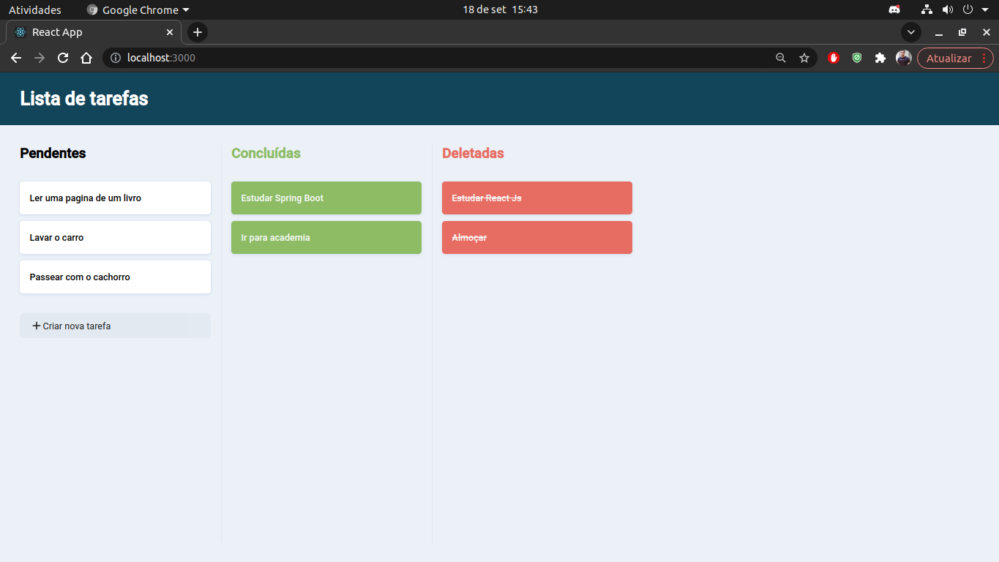

# Project Task

O projeto consiste em um sistema de tarefas, onde o usuário consegue criar, concluir e deletar uma tarefa. (A funcionalidade exclusão é apenas aplicada na alteração correspondente em um status da tarefa, para atender o desafio proposto).

## Layout da Aplicação

  
  

  

  
  

<h2>🛠 Tecnologias Utilizadas</h2>

  
   
    
   
    
 

